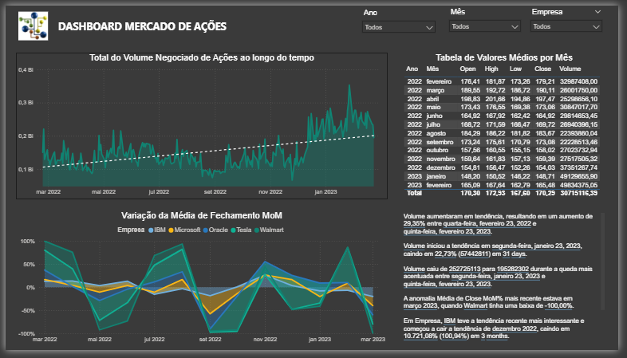

# Projeto 7 - Análise de Dados do Mercado de Ações
Projeto do curso: "Microsoft Power BI Para Business Intelligence e Data Science", por [Data Science Academy](www.datascienceacademy.com.br). 

## Entendimento do Negócio

O  mercado  de  ações  é  um  sistema  no  qual  as  empresas  vendem  frações  de  sua propriedade  (chamadas  ações)  para  investidores,  que  por  sua  vez  se  tornam  proprietários parciais da empresa. Quando as empresas têm lucro, os acionistas também recebem uma parte desses lucros na forma de dividendos. Além disso, o valor das ações pode subir ou descer com base em vários fatores, como desempenho financeiro da empresa, mudanças na economia ou na indústria em que a empresa opera, bem como decisões políticas e regulatórias.  

Os investidores compram e vendem ações no mercado de ações, geralmente usando uma corretora ou plataforma de negociação on-line para fazer as transações. O mercado de ações é frequentemente  visto  como  um  indicador  da  saúde  econômica  geral  de  um  país,  e  é frequentemente  usado  como  uma  forma  de  investimento  para  indivíduos  e  instituições financeiras em todo o mundo.  

Este projeto foi  trabalhado  com  dados  reais  extraídos  do  portal  da  Nasdaq.  A NASDAQ  (National  Association  of  Securities  Dealers  Automated  Quotations)  é  uma  bolsa  de valores eletrônica americana, fundada em 1971. É a segunda maior bolsa de valores do mundo em termos de capitalização de mercado, atrás apenas da Bolsa de Valores de Nova York (NYSE).

## Desenvolvimento do Projeto

### Entregas para o Negócio
1. Qual o total de volume negociado de açõesao longo do tempo para as 5 empresas que  estão  sendo  analisadas?  Permita  que  essa  análise  seja  feita  para  uma  única empresa ou combinação de empresas.
2. Qual  o  valor  médio  de  abertura  (Open),  mais  alto  (High),  mais  baixo  (Low)  e  de fechamento (Close) das ações de todas as empresas para todos os meses do período de  dados  analisado  (1  ano  em  nosso  exemplo)?  Mostre  no  formato  de  tabela  e permita  que  essa  análise  seja  feita  para  uma  única  empresa  ou  combinação  de empresas.
3. Qual  a  variação  da  média  do  valor  de fechamento  (close)  das  ações  de  todas  as empresas  ao  longo  do  tempo,  mês  a  mês?  Permita  que  essa  análise  seja  feita  para uma única empresa ou combinação de empresas.
4. Narrativa Inteligente para explicar as principais características e tendências nos dados.

### Sobre o Dataset
[Os dados podem ser extraídos gratuitamente da Nasdaq acessando o link: https://www.nasdaq.com/market-activity/stocks](https://www.nasdaq.com/market-activity/stocks)

Os  dados  da  NASDAQ  incluem  várias  colunas,  cada  uma  fornecendo  informações específicas sobre o preço e o volume de negociação das ações negociadas no mercado. 
- Coluna  "Date"  (Data):  Esta  coluna  fornece  a  data  em  que  a  ação  foi  negociada  na NASDAQ.
- Coluna  "Close/Last"  (Fechamento/Último  Preço):  Esta  coluna  fornece  o  preço  de fechamento  da  ação  na  NASDAQ  no  final  do  dia  de  negociação.  O  preço  de fechamento é o último preço pelo qual a ação foi negociada naquele dia.
- Coluna "Volume": Esta coluna indica o número total de ações negociadas durante o dia. Issopode incluir várias transações feitas por um ou mais investidores.
- Coluna "Open" (Preço de Abertura): Esta coluna indica o preço de abertura da ação na NASDAQ no início do dia de negociação. O preço de abertura é o primeiro preço pelo qual a ação foi negociada naquele dia.
- Coluna "High" (Preço Máximo) e "Low" (Preço Mínimo): Estas colunas indicam o preço máximo e mínimo que a ação foi negociada naquele dia. O preço máximo é o preço mais alto pelo qual a ação foi negociada durante o dia, enquanto o preço mínimo é o preço mais baixo pelo qual a ação foi negociada.

### Dicionário de Dados
| Coluna               | Descrição                                  | Tipo     |
| -------------------- | ------------------------------------------ | -------- |
| **Empresa**          | Nome ou código da empresa listada na bolsa | Texto    |
| **Data**             | Data de referência da negociação           | Data     |
| **Open**             | Preço da ação na abertura do pregão        | Numérico |
| **High**             | Maior preço atingido pela ação no dia      | Numérico |
| **Low**              | Menor preço atingido pela ação no dia      | Numérico |
| **Close**            | Preço da ação no fechamento do pregão      | Numérico |
| **Volume**           | Quantidade de ações negociadas no dia      | Inteiro  |

### Dataviz do Projeto
Segue solução proposta, com as respostas solicitadas para a área de negócio.

[End]

### 👍 Meus contatos
- LinkedIn - [renato-malbuquerque](https://www.linkedin.com/in/renato-malbuquerque/)
- GitHub - [renato-albuquerque](https://github.com/renato-albuquerque)
- Discord - [Renato Albuquerque#0025](https://discordapp.com/users/992621595547938837)
- Business Card - [Renato Albuquerque](https://rma-contacts.vercel.app/)
